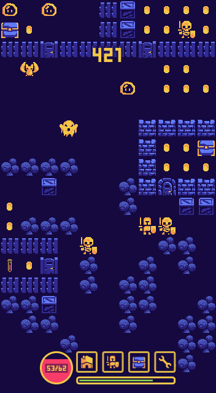
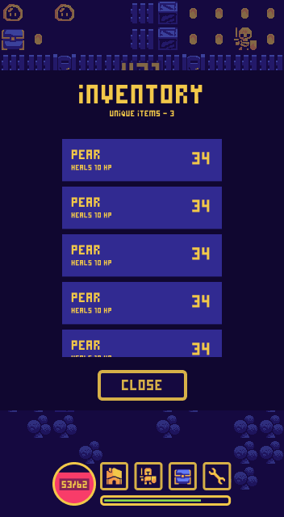
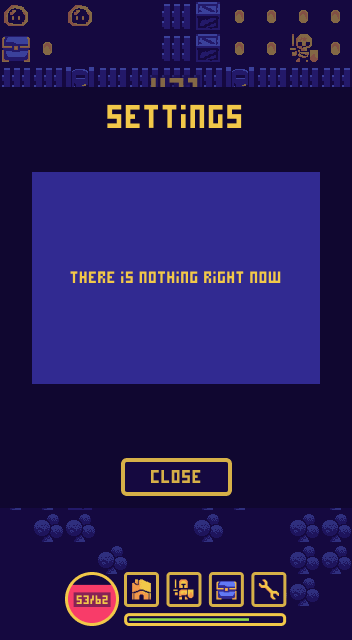
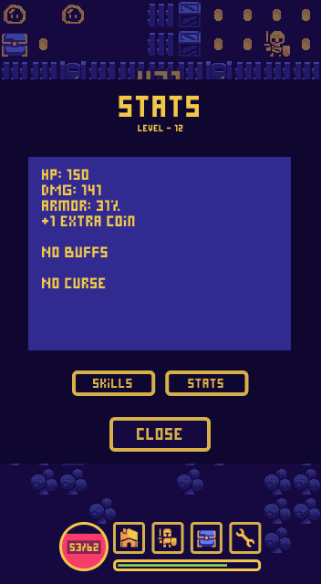
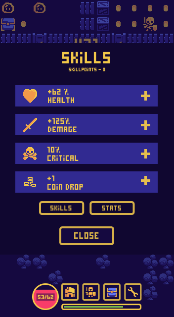

# 8BIT JOURNEY

## PRAVIDLA:
- První se vždy pohne hráč, až poté nepřítel.
- Hráč se může bohybovat do všech čtyř směrů (doprava, doleva, dolů, nahoru).
- Pokud se hráč nacházi asi v polovině obrazovky a pohne se nahoru, pohne se s ním i vše ostatní. Hra je procedurálně generovaná.
- Herní pole je čtvercový grid o jedenácti sloupcích, začínající ze shora (dole nemusí končit přesně).
- Cílem je získat co nejvyšší skóre.
- Skóre je určeno podle počtu řádků o které hráč postoupil směrem nahoru (každý řádek je připočten pouze jednou).
- Cestou nahoru se hráč bude setkévat s nepřáteli.  Pokud se hráč dostane příliš blížko (na vzdálenost 1 pole) nepřítel se pohne k hráči, tedy zaůtočí.
- Útok nastane ve chvíli, kdy se hráč (nebo nepřítel) chce pohnout směrem ve kterém je nepřítel (hráč). První útočí hráč (= pokud nepřítele zabije na jednu ránu, nepřítel mu neubere životy).
- Každý nepřítel má daný počet životů. Ty se odvyjí od jejich levelu.
- Level nepřátel se bude postupně zvyšovat (podle řádku na kterém se poprvé objeví).
- Začíná ve chvíli, kdy se nepřítel snaží pohnout směrem na kterém stojí hráč nebo naopak.

### BĚHEM HRY MŮŽETE JE MOŽNO VIDĚT
- HUD
    - menu
        - home buton (esc)
        - skill/equipment
        - inventář
        - nastavení
    - životy hráče
    - životy cíle (nepřítel, krabice, krystal)
    - level/xp-bar
- prostor
    - překážky
        - plot (+dveře)
        - zdi (+dveře)
        - další (stromy, prázdné bedny...)
    - bonusy
        - bedny
        - krabice
        - peníze
        - lektvary
        - klíče
    - enemy
        - slime
        - kostlivec
        - netopír
        - ...
    - hráč

## IMPLEMENTACE

```html
<div class="all">
    <div class="wrapper">
      <div class="hud-wrapper">
        <div class="up">
          <div class="score">
            <span>451</span>
          </div>
        </div>
        <div class="down">
          <nav class="hud">
            <div class="health">
              <span class="text-outline">60/80</span>
              <div class="health-bar-wrapper">
                <div class="health-bar" health="75%"></div>
              </div>
            </div>
            <div class="home"></div>
            <div class="stats"></div>
            <div class="inventory"></div>
            <div class="settings"></div>
            <div class="xp">
              <div class="xp-bar"></div>
            </div>
          </nav>
        </div>
      </div>
      <div class="game">
      </div>
    </div>
</div>
```

### OBJEKTY
Veškeré objekty se umisťují jako <div> se třemi classami:
- 1. classa určuje typ objektu
    - překážky
        - .wall 
        - .fence 
        - .door 
        - .stone-door 
        - .tree 
        - .crate
    - bonusy
        - .chest
        - .coin
        - .health-potion
        - .big-health-potion
        - .key
    - enemy
        - .slime
        - .skeleton
        - .bet
        - .reaper
        - .ghost
        - .spider
    - hráč
        - .player
- druhá classa určuje vodorovnou pozici (0 - 10)
    - .column-3 = objekt je na čtvrtém sloupci
- třetí classa určuje svislou pozici  (0 - 19)
    - .row-3 = objekt je na čtvrtém řádku

### UKÁZKY STAVU

¨
<br />
náhodná chvíle ze hry
¨
<br />
otevřený inventář
¨
<br />
otobvřené okno nastavení
¨
<br />
otevřené staty postavy
¨
<br />
otevřené skilly postavy